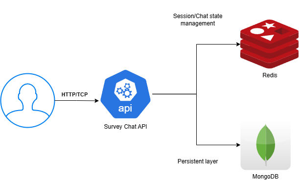

# Survey chatbot API

## How to run the project?

First, install the dependencies:

```bash
poetry install
```

Then start the database and Redis:

```bash
docker-compose up -d
```

Finally, run the project:

```bash
poetry run uvicorn app.main:app --reload
```

## How to run the tests?

```bash
poetry run pytest tests/
```

## System architecture



- MongoDB is used to store the survey data because of the flexible schema design, that allows to store the survey data in a more convinient way; while also providing a fast and scalable solution.
- Redis is used to store the chat session and history. Chat history is not persisted, but it's stored in memory to provide a fast response and allow to to recover from crashes in the server side, but also client disconnects. The idea behind moving sessions to Redis is to allow the API server to be stateless and scale horizontally.

## Application design


For the application design, a 3 layer architecture is used:

1. **API/Routes layer**: Handles the incoming requests and responses for a HTTP client.
1. **Service layer**: Handles the business logic.
1. **Persistence layer**: Handles the data storage and retrieval.

There's a sublayer in the persistence layer that is used for session management using Redis. Additionally, it is important to note that dependency injection is used to avoid tight coupling between the layers. Thus, each layer can be easily replaced by a different implementation, and also easily testable by unit tests.

In addition to the layers, models are used to define the data structures and their validations. Models are defined in the `backend/app/models` folder. There are three types of models: 

- **BaseModel**: A base model that contains the common fields and validations for all models.
- **API models**: Models used to validate the data from the HTTP requests.
- **Database models**: Models used to define the data structure and their validations for the database.

The idea behind the models is to have a clear separation of concerns, and also to be able to validate the data from the HTTP requests and the database.

## Error handling

There are special exceptions that were created to model the errors of the application to avoid generic messages getting all the way to the client. These exceptions are defined in the `backend/app/exceptions` folder. Additionally, each layer handles the particular exceptions that are relevant to it. For instance, the API layer handles the exceptions that are related to the HTTP requests, and the service layer handles the exceptions that are related to the business logic.

## The survey response flow

The flow of the survey response is as follows:

1. The client connects to the chatbot specifying it's id and the survey
   - If the survey response does not exist, it is created
   - If the survey response exists, it is retrieved and stored in the session
   - If the survey response is complete, an error is returned
2. The chatbot sends the first question to the client, as soon as the client connects.
3. For each question, the client sends the answer to the chatbot
4. The answer is validated and saved to the survey response in the database
5. The chatbot sends the next question to the client
6. If there are no more questions, the chatbot sends a goodbye message and the session is closed

## API Documentation

For the exposed endpoints, Swagger is used to document the API. The documentation can be accessed at `http://localhost:8000/docs`.

### Optional Enhancements

- External DB
- Sessions managed in Redis
- Survey management endpoints
- API documentation
- Conditional branching in the questions
- More complex question types (e.g. multiple choice, rating)
- Websocket connection for the chatbot

## Future Enhancements

- Add readiness probes that check if the database and Redis are ready to receive requests.
- Add metrics to the application to analyze the different parts of the application. For instance, the number of requests, the response time, the number of errors, etc.
- Add a monitoring dashboard to monitor the application.
- Use structured logging to ease the analysis of the logs.
- During the chat interaction, use background tasks when writing to the database to improve latency in the chat interaction while still having the data persisted. This could be done by using a write-through cache setup.

## Assumptions

- The chat history is not needed to be persisted, as we keep track of the responses.
- A client can have multiple active surveys at the same time, but no connection will be recieved for the same client and survey id at the same time.
- Messages between the client and the chatbot will be interleaving, one message from the chatbot, one from the client, etc.
- I used a simplified version of the chatbot interaction, but it could be easily extended to be more friendly during conversations.
